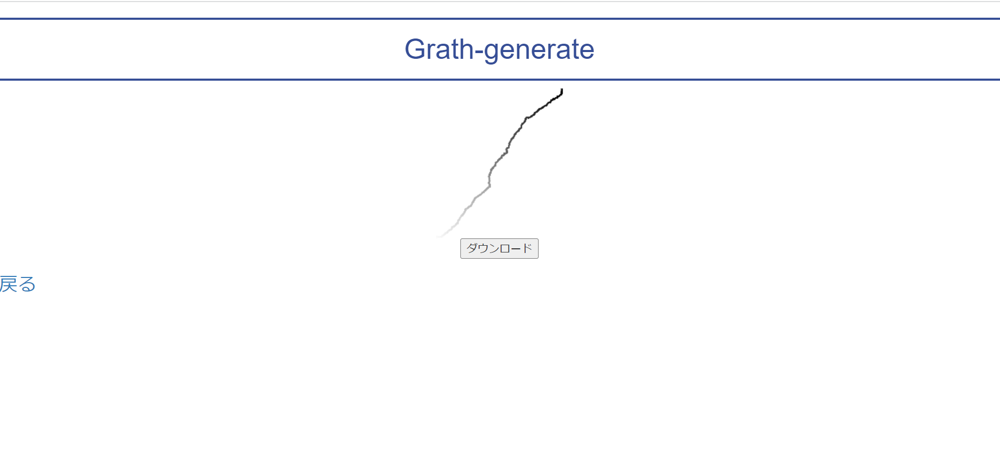
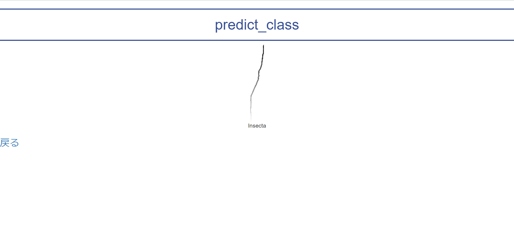
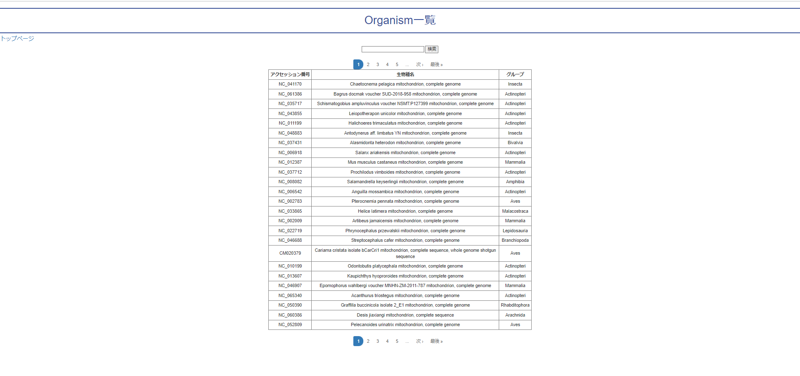

# ミトコンドリアゲノム配列の画像化と、その画像データからどの網に分類できるかを深層学習を用いて予測するwebアプリ

## 概要

自身の研究であるミトコンドリアゲノムに関してのものとなっている。2つの機能があり、グラフ画像の生成と生物分類の予測を行うことができる。どちらの機能も入力には、生物データに割り当てられているアクセッション番号と呼ばれる記号を用いる。データベースを参照することができるので、基本その中からアクセッション番号を選び、分類予測の機能ではそれ以外のものも入力することができる。

## ページ外観

1. トップページ

2. グラフ画像ページ

3. 分類予測ページ

4. データベースページ

