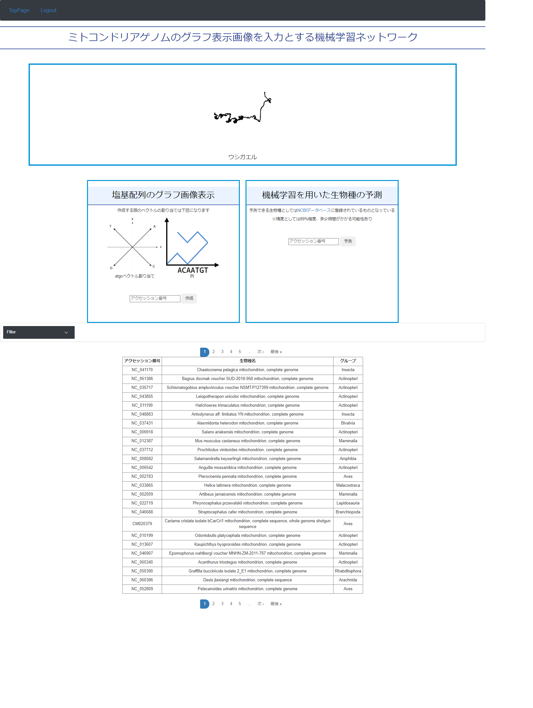

# ミトコンドリアゲノム配列のグラフ画像化と、その画像データからどの網に分類できるかを深層学習を用いて予測するwebアプリ

## 環境
- Ubunts 22.04 LTS
- ruby 2.7.7
- ruby on rails 5.2.8

## 概要

自身の研究であるミトコンドリアゲノムに関してのものとなっている。2つの機能があり、グラフ画像の生成と生物分類の予測を行うことができる。どちらの機能も入力には、生物データに割り当てられているアクセッション番号と呼ばれる記号を用いる。データベースを参照することができるので、基本その中からアクセッション番号を選び、分類予測の機能ではNCBIデータベースに登録されているものも入力することができる。※アプリの機能を扱うには、ログインする必要があり、ユーザー作成はadminユーザーのみ行うことができる。

